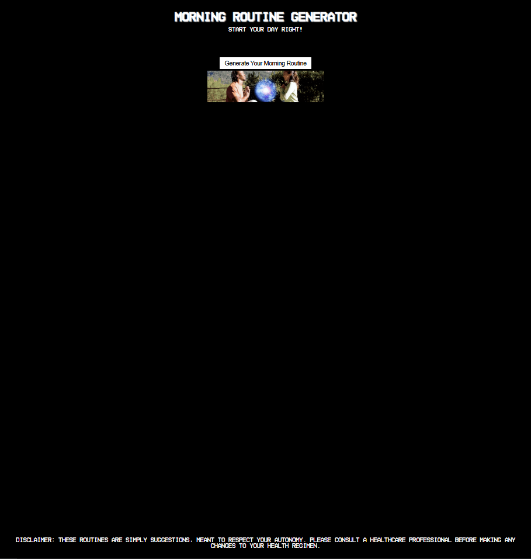

---

## Technologies Used
- **HTML5**: For the structure of the web page.
- **CSS3**: For styling and responsiveness.
- **JavaScript**: For interactivity and dynamic content generation.
- **Font Awesome**: For icons (mute/play buttons).
- **Custom Font**: HomeVideo for a unique typographic style.

---

## Contributing

Contributions are welcome! If you’d like to improve this project, follow these steps:

1. Fork the repository.
2. Create a new branch (`git checkout -b feature/YourFeatureName`).
3. Commit your changes (`git commit -m 'Add some feature'`).
4. Push to the branch (`git push origin feature/YourFeatureName`).
5. Open a pull request.

---

## License

This project is open-source and available under the [MIT License](https://opensource.org/licenses/MIT). Feel free to use, modify, and distribute it as you see fit.

---

## Acknowledgments

**Unifyd TV** for the affiliate banner link.

---

## Screenshot

  
_(Replace with an actual screenshot of your project)_

---

## Live Demo

Check out the live demo [here](#) _(add a link to your hosted project if available)_.
